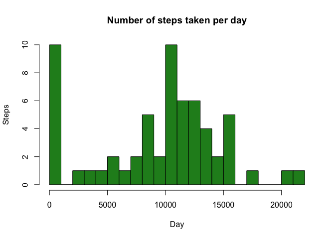
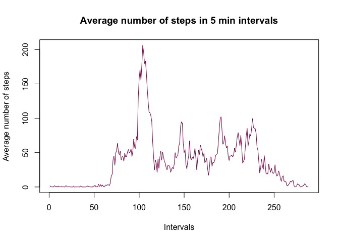
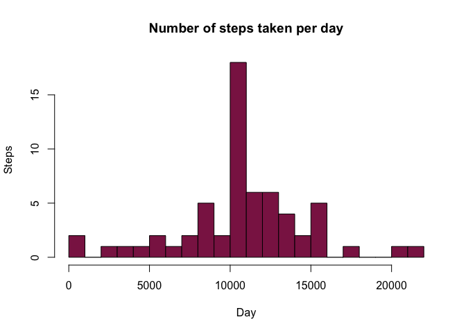
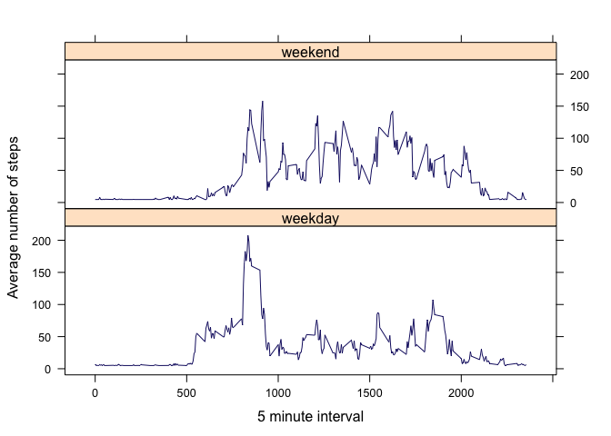

# Reproducible Research: Peer Assessment 1


## Loading and preprocessing the data
- Unzip the file
- Read in the values and save as variable "act"
- Convert the values in the date column to date class variables


```r
unzip("./activity.zip")
act<-read.csv("activity.csv")
act$date<-as.Date(act$date,"%Y-%m-%d")
```

## What is mean total number of steps taken per day?
- Split the dataframe into a list seperated by date
- Find the sum of the total number of steps taken each day
- Plot the data in a histogram


```r
temp1<-split(act,act$date)
total<-sapply(temp1,function(x) colSums(x[c("steps")],na.rm=T))
hist(total, col="forestgreen", main="Number of steps taken per day",xlab="Day",ylab="Steps", breaks=25)
```

 


The mean number of steps taken each day is:

```r
mean(total)
```

```
## [1] 9354
```
The median number of steps taken each day is:

```r
median(total)
```

```
## [1] 10395
```

## What is the average daily activity pattern?
- Split the date based on the 5 minute time interval
- Average the data for each 5 minute time interval
- Plot the data in a line graph


```r
temp2<-split(act,act$interval)
int_total<-sapply(temp2,function(x) colMeans(x[c("steps")],na.rm=T))
plot(int_total,type="l", main="Average number of steps in 5 min intervals", xlab="Intervals",ylab="Average number of steps", col="deeppink4")
```

 


The 5 minute interval with the largest number of average steps is:

```r
which.max(int_total)
```

```
## 835.steps 
##       104
```

## Imputing missing values
The total number of missing values in the dataset is:

```r
sum(is.na(act$steps))
```

```
## [1] 2304
```
I will replace the NA's with the mean number of steps taken

```r
temp3<-act[!is.na(act$steps),] 
M<-mean(temp3$steps)
NAdata<-act
for (i in 1:length(NAdata$steps))
  {if (is.na(NAdata$steps)[i]==1)
    {NAdata$steps[i]<-M}
}
```
Now create the histogram of the total number of steps taken each day

```r
temp4<-split(NAdata,NAdata$date)
total2<-sapply(temp4,function(x) colSums(x[c("steps")],na.rm=T))
hist(total2, col="violetred4", main="Number of steps taken per day",xlab="Day",ylab="Steps", breaks=25)
```

 


The mean number of steps taken each day is:

```r
mean(total2)
```

```
## [1] 10766
```
The median number of steps taken each day is:

```r
median(total2)
```

```
## [1] 10766
```

The new mean and median values created when substituting in a single value for NA are both higher than the previous mean and median values calculated by disregarding NAs. This is because NA entries are extremely prevelent in this dataset. Altering the NA values has a significant impact on the structure of the dataset. 

## Are there differences in activity patterns between weekdays and weekends?
Create a new factor variable in the dataset with two levels – “weekday” and “weekend” indicating whether a given date is a weekday or weekend day.

```r
NAdata$day<-ifelse(weekdays(NAdata$date)=="Sunday"|weekdays(NAdata$date)=="Saturday","weekend","weekday")
NAdata$day<-as.factor(NAdata$day)
```
- Split the data into two subsets by weekend and weekday
- Then split the date based on the 5 minute time interval
- Average the data for each 5 minute time interval

```r
wkend<-subset(NAdata,day=="weekend")
wkday<-subset(NAdata,day=="weekday")

wkend<-split(wkend,wkend$int)
wkday<-split(wkday,wkday$int)
int_wkend<-sapply(wkend,function(x) colMeans(x[c("steps")]))
int_wkday<-sapply(wkday,function(x) colMeans(x[c("steps")]))
```
- Make sure everything is still named properly.
- Then combine the data back into a single dataframe

```r
#make the 5 min interval names numerics instead of characters
IntNameWkend<-as.numeric(names(wkend))
IntNameWkday<-as.numeric(names(wkday))
#combine the column with the name of the time interval and the #column with the average over that time interval into a single data #frame
endDF<-data.frame(IntNameWkend,int_wkend)
dayDF<-data.frame(IntNameWkday,int_wkday)
#Add a column to each dataframe to designate whether it is a weekend #or a weekday
endDF$day<-c("weekend")
dayDF$day<-c("weekday")
#Add the same labels to each dataframe so they combine nicely
names(endDF)<-c("interval","avgsteps","day")
names(dayDF)<-c("interval","avgsteps","day")
#combine the two dataframes
totalDF<-rbind(endDF,dayDF)
```
Use the lattice graphing system to create the plots

```r
library(lattice)
xyplot(totalDF$avgsteps~totalDF$interval|totalDF$day,type="l",layout=c(1,2),xlab="5 minute interval",ylab="Average number of steps", col="midnightblue")
```

 
